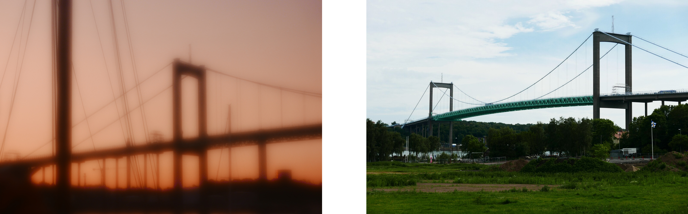
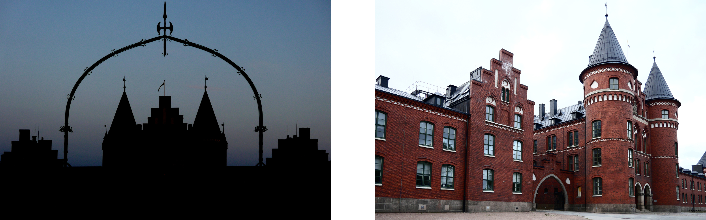

# Vykort från Göteborg

Jag är ingen konstnär, och mitt yrke spelar en viktig roll i detta projekt (som har en [webbplats](harisont.github.io/postcards-from-gothenburg/) som slutprodukten): jag är mjukvaruutvecklare och arbetar med språkteknik. Då får man säga att jag är mest intresserad av _språk_, vilket avser både programmering och mänskliga språk. 

Projektet inspireras av en bok om kreativt skrivande som har en ganska teknisk inriktning: _Grammatica della Fantasia_ ("Fantasins Grammatik") av Gianni Rodari. Rodari förespråkar __lärande genom lek__ och föreslår en rad kreativa övningar som låter vuxna och barn leka med ord. Målet är, förklarar förfättaren, att se till att alla, oavsett social status, kan använda språket på alla möjliga sätt, inklusive kreativt. "Inte för att alla ska vara konstnärer", skriver han, "utan för att ingen ska vara slav" ¹.

Enligt min åsikt gäller detta för alla konstformer, och alla kan dra nytta av att utöva en av dem. Med detta projekt är det då syftet att lära mig att arbeta med fotografi _systematiskt_, och på tal om __systematik__ minns jag ett annat litterärt verk: Raymond Queneaus _Exercices de Style_ ² ("Stilövningar"), där samma historia omvandlas och berättas på 99 olika sätt. 

Ordet _omvandla_ är viktigt, eftersom de "stilövningar" som jag valt är __arkitektoniska omvandlingar__. Fotografierna, som visar icke-turistiska byggnader och landmärken i Göteborg, tas i par: en experimentell bild, där motivet omvandlas, och en "vykort" eller referensdbild. De som följer är exempel på hur jag använder olika omvandlingstekniker.

## Detaljframhävning
En enkel idé är att bara visa en detalj av en byggnad, som i fallet med den här fabriken.

## Okonventionella synvinklar
Ett alternativ är att välja en okonventionell synvinkel. Johanneberg Science Park fotograferades till exempel under- och bakifrån.

## Reflektioner
En annan möjlighet är att inte visa landmärket direkt, utan snarare dess reflektion.

## Funktionssändring
Man kan även få en byggnad med en viss funktion (t.e. ett bibliotek) att se ut som en med ett annat syfte (i detta fall en kyrka).

## "Landmärke A som landmärke B"
Sist kan man försöka framkalla ett annat, kanske mer välkänt landmärke (Disneyslottet i exemplet).

---

¹ Gianni Rodari, _Grammatica della Fantasia_. Einaudi 1973. Egen översättning.

² Raymond Queneau, _Exercices de Style_. Publicerades första gången i tidskriften _Messages_ 1943. 