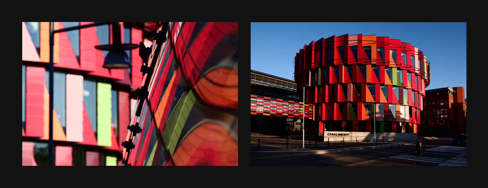
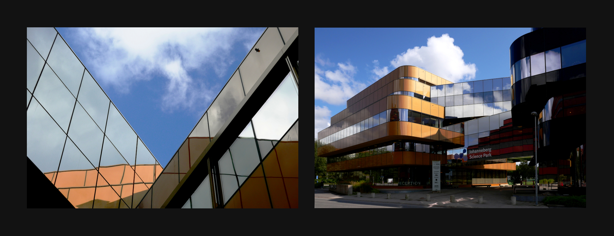
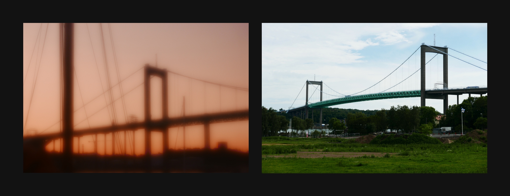
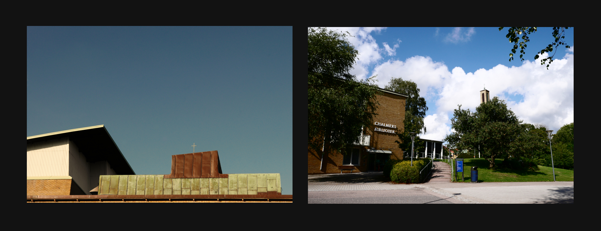
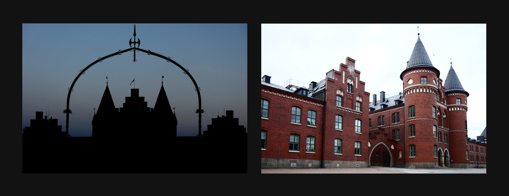

## Kort om mig
- jag är ingen konstnär
- detta är mitt första försök att arbeta med fotografi på ett systematiskt sätt
- detta är också första gången jag experimenterar med arkitekturfotografi

## Metod
Huvudtanke: __lärande genom lek__.

Inspiration:

- Raymond Queneau, _Exercices de Style_
- Gianni Rodari, _La Grammatica della Fantasia_

## Kort om projektet
(Anti-)vykort från Göteborg:
  
- icke-turistiska områden, byggnader och landmärken
- "experimentella" bilder (i par med sina "konventionella" motsvarigheter): Målet är att "__omvandla__" de arkitekturer som man ser varje dag

## Omvandlingar
Sätt att omvandla en arkitektur:

- framhäva en detalj
- välja en okonventionell synvinkel
- visa landmärket i en reflektion i vattnet eller i ett fönster
- få en byggnad med en viss funktion (t.ex. en fabrik) att se ut som en byggnad med ett annat syfte (t.ex. en kyrka)
- visa baksidan av en byggnad i stället för dess fasad
- få ett landmärke att se ut som ett annat landmärke
- ...

# Exemplor

## Detaljer

## Okonventionella synvinklar

## Reflektioner

## Ändrad funktion

## Landmärke A som landmärke B

## Slutprodukt
Webbsida med 3D vykort

# Frågor?